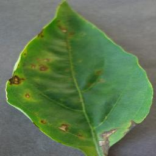
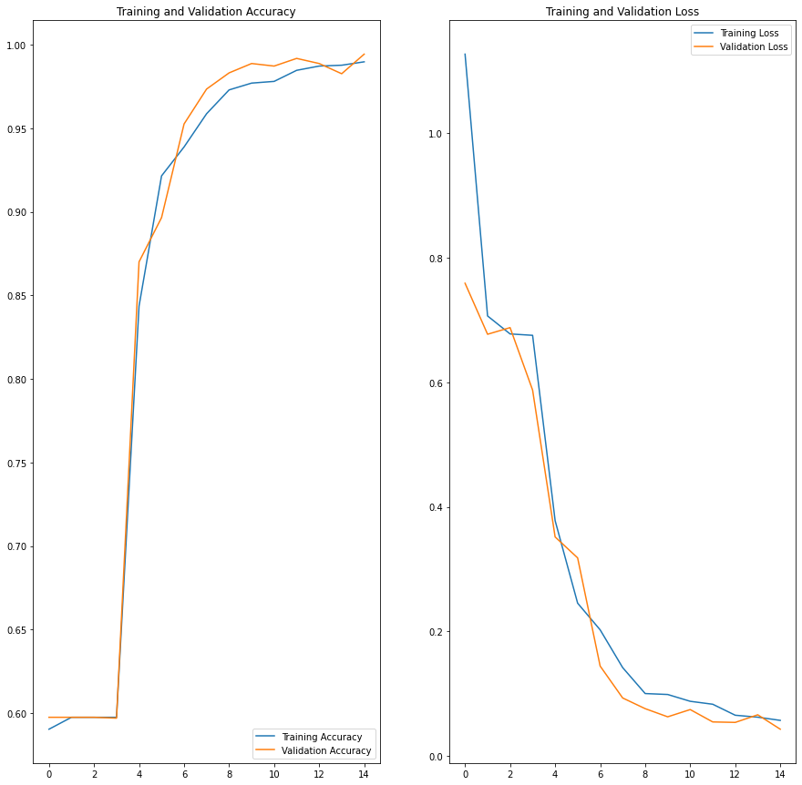
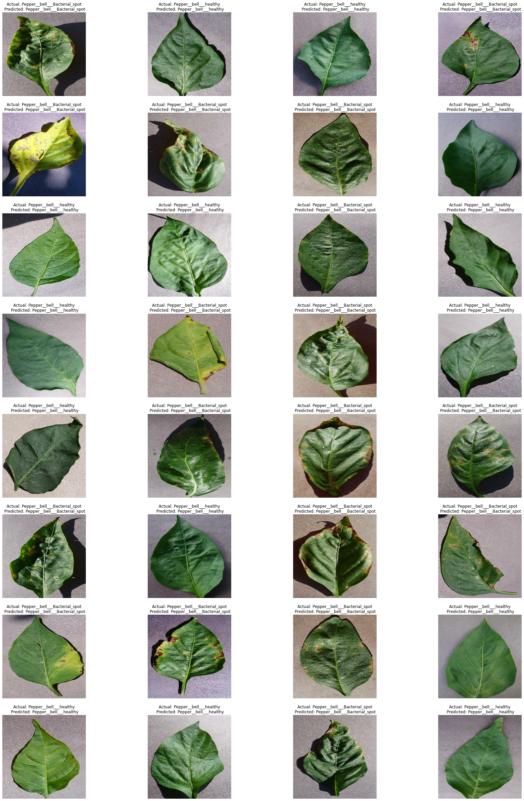

# Pepper-Plant-Disease-Classification
Classification of healthy and bacterial leaf of Pepper plant.
Bacterial leaf spot is a common bacterial plant infection seen all around the world. It is most common rainy, humid and temperate climate.

# Dataset
Total 2496 images have been used for classification, out of which 1478 are of healthy leafes and 997 are bacteria affected.

Healthy Leaf 
 
Bacterial Spot Leaf 
 

# Data Augmentation
Data augmentation technique like RandomFlip & RandomRotation has been used to increase the number of images to get better results

# Convolution Neural Network
A CNN model is created for image classification with activation relu for Convolution and Dense layers and activation sigmoid for output layer for Binary Classification. 
To counter overfitting L2 Regularization and Dropout method is used. 

# Training
model is trained for 15 epochs with adam optimizer. The training accuracy is 98.98% and validation accuracy is 99.44%. 
Below graph for the Training and Validation Accuracy & Loss 
 

# Prediction
Prediction is done on a batch of a test dataset and below are the results. 
 
